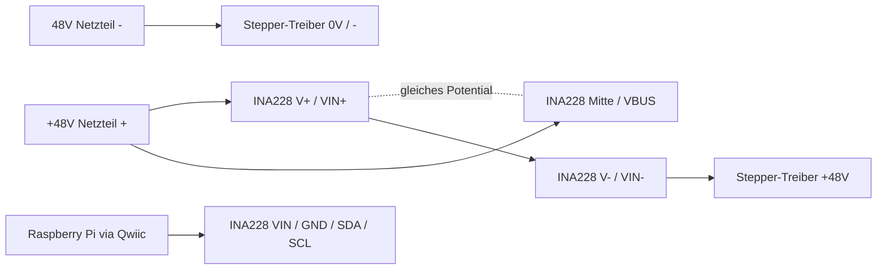
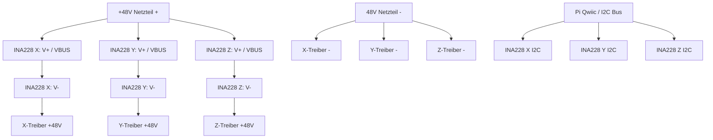

# Adafruit INA228 Achslast-Sensoren

## Rolle im System

- Modultyp: `Adafruit INA228 I2C Power Monitor` (Adafruit Produkt `5832`)
- Sensorfamilie im Projekt: drei baugleiche Module fuer `X`, `Y` und `Z`
- Aufgabe im Projekt: reale Strom-/Leistungsaufnahme der Achsen erfassen
- Messbereich laut eingesetztem Breakout:
  - Spannung `0-85 V`
  - Strom `bis 10 A`
- Darstellung im Dashboard:
  - rohe Messwerte als `currentA`, `powerW`, `busVoltageV`, `shuntVoltageMv`, `dieTemperatureC`
  - daraus abgeleiteter `loadPercent` fuer die bestehende Achslast-Anzeige im Frontend

## Funktionsprinzip

- Der `INA228` ist ein praeziser I2C-Leistungsmonitor fuer Strom, Spannung und Leistung.
- Auf dem Adafruit-Breakout ist bereits ein `15 mOhm` Shunt-Widerstand verbaut.
- Das Modul misst:
  - `VBUS`: Busspannung
  - `VSHUNT`: Spannungsabfall ueber dem Shunt
  - `CURRENT`: berechneter Strom
  - `POWER`: berechnete Leistung
  - `DIETEMP`: interne Chiptemperatur
- Das Dashboard verwendet die gemessene Achs-Stromaufnahme fuer einen normierten `loadPercent`:
  - Formel: `abs(currentA) / referenceCurrentA * 100`
  - die Referenzstroeme sind pro Achse per Umgebungsvariable anpassbar

## Anschluss und Adresse

- Bus: `I2C`
- Aktueller Bus auf dem Raspberry Pi: `/dev/i2c-1`
- Anschlussart: ueber `Qwiic / STEMMA QT`
- I2C-Spannung im aktuellen System: `3.3 V`
- Relevante Leitungen: `3V3`, `GND`, `SDA`, `SCL`

Aktuell verifiziert:

- `X`-Achse: `0x40`

Fuer die weitere Kette im Projekt vorgesehen:

- `Y`-Achse: `0x41` im aktuellen Live-Scan sichtbar
- `Z`-Achse: `0x44` im aktuellen Live-Scan sichtbar

Hinweis:

- Das Adafruit-Board besitzt zwei Address-Jumper `A0` und `A1`.
- Dadurch koennen mehrere INA228-Boards am selben I2C-Bus betrieben werden.
- Fuer `Y` und `Z` sind die Adressen im Backend konfigurierbar, falls die reale Verdrahtung davon abweicht.

## Anschluss an die 48V-Stepper-Treiber

Wichtig:

- Die INA228-Module sollten hier als `High-Side`-Messung im `+48V`-Zweig eingesetzt werden.
- Daraus folgt fuer den CNC-Aufbau: pro Achse kommt ein INA228-Modul in Serie zwischen `48V+` des Netzteils und `48V+` des jeweiligen Stepper-Treibers.
- Die `48V-`-Leitung des Netzteils geht direkt zum `-`-Eingang des jeweiligen Treibers und **nicht** durch den INA228.

Klemmenbelegung des 3-poligen Schraubblocks:

| Schraubklemme | INA228-Pin | Funktion im Achs-Aufbau |
|---|---|---|
| `V+` links | `VIN+` | Eingang von `+48V` vom Netzteil |
| `Mitte` | `VBUS` | Busspannungs-Messpunkt, ebenfalls an `+48V` |
| `V-` rechts | `VIN-` | Ausgang weiter zum `+48V`-Eingang des Stepper-Treibers |

Die mittlere Klemme ist also nicht "ungenutzt", sondern der `VBUS`-Messanschluss.

Fuer `High-Side` muss `VIN+` und `VBUS` auf demselben `+48V`-Potential liegen. Das geht auf zwei Arten:

- Entweder `V+` und die mittlere `VBUS`-Klemme beide an `+48V` anschliessen.
- Oder den `VBUS`-Jumper auf der Rueckseite fuer den High-Side-Betrieb setzen, sodass `VBUS` intern mit `VIN+` verbunden ist.

Empfohlene Verdrahtung pro Achse:

1. `48V Netzteil +` an `V+` des passenden INA228-Moduls.
2. `48V Netzteil +` zusaetzlich an die mittlere `VBUS`-Klemme desselben Moduls, falls der `VBUS`-Jumper **nicht** gesetzt ist.
3. `V-` des INA228 an den `+48V`-Eingang des Stepper-Treibers dieser Achse.
4. `48V Netzteil -` direkt an den `-`-Eingang des Stepper-Treibers.
5. `Qwiic` verbindet nur `3V3`, `GND`, `SDA`, `SCL` mit dem Raspberry Pi und fuehrt **nicht** den Motorstrom.

Kurz gesagt:

- `Netzteil + -> INA228 V+ / VBUS -> INA228 V- -> Treiber +`
- `Netzteil - -> Treiber -`

Grafik fuer eine Achse:



Grafik fuer alle drei Achsen:



Hinweise zur Praxis:

- Pro Achse wird ein eigenes INA228-Modul benoetigt.
- Das Modul misst den Strom der einzelnen Achse nur dann separat, wenn wirklich nur der zugeordnete Stepper-Treiber hinter diesem einen INA228 haengt.
- Die Messung sollte im `+48V`-Zweig bleiben; den `-`-Rueckleiter nicht ueber den INA228 fuehren.
- Falls `X`, `Y` und `Z` gleichzeitig am selben Qwiic-Bus haengen, muessen die I2C-Adressen ueber `A0/A1` unterschiedlich gesetzt sein.

## Verifikation

- Datum: `2026-04-06`
- Zielsystem: `ssh cncpi`
- I2C-Scan auf dem Pi:
  - `0x21` = `PCF8574`-kompatibles Safety-Input-Modul
  - `0x38` = `AHT20`
  - `0x40` = `INA228` fuer die `X`-Achse
  - `0x41` = `INA228` fuer die `Y`-Achse
  - `0x44` = `INA228` fuer die `Z`-Achse
  - `0x52` = `GHI GDL-ACRELAYP4-C`
- Direkter Registerzugriff auf `0x40` war erfolgreich
- Im aktuellen Aufbau antworten damit alle drei vorgesehenen INA228-Adressen auf dem Bus

## Backend-Anbindung

- Python-Treiber: `backend/cnc_hardware/sensors.py`
  - Klasse: `INA228Sensor`
- Hardware-Fassade: `backend/cnc_hardware/service.py`
- Laufzeit: innerhalb von `cnc-dashboard-backend.service`
- HTTP-Endpunkte:
  - `GET /api/hardware`
  - `GET /api/hardware/axis-loads`
  - `GET /api/axes`
  - `GET /api/axes/stream`

## API-Ansteuerung

- Primaerer Hardware-Endpunkt fuer die Sensorgruppe: `GET /api/hardware/axis-loads`
- Sammelendpunkt mit eingebetteten Achslasten: `GET /api/hardware`
- Live-Frontend-Stream: `GET /api/axes/stream`

Typische Rueckgabefelder von `GET /api/hardware/axis-loads`:

- `available`: Ob mindestens ein INA228 erfolgreich gelesen werden konnte
- `axes.x|y|z.available`: Status pro Achse
- `axes.<axis>.loadPercent`: normierter Lastwert fuer das Dashboard
- `axes.<axis>.currentA`: gemessener Strom
- `axes.<axis>.powerW`: gemessene Leistung
- `axes.<axis>.busVoltageV`: gemessene Busspannung
- `axes.<axis>.shuntVoltageMv`: Spannungsabfall am Shunt
- `axes.<axis>.dieTemperatureC`: interne Sensor-Temperatur
- `axes.<axis>.error`: Fehlertext bei fehlender Antwort oder I2C-Problemen

## Umgebungsvariablen

Pro Achse koennen diese Werte gesetzt werden:

- `AXIS_LOAD_X_SENSOR_ENABLED`
- `AXIS_LOAD_X_SENSOR_I2C_ADDRESS`
- `AXIS_LOAD_X_SHUNT_RESISTANCE_OHMS`
- `AXIS_LOAD_X_CALIBRATION_MAX_CURRENT_A`
- `AXIS_LOAD_X_REFERENCE_CURRENT_A`

Dieselbe Struktur gilt analog fuer `Y` und `Z`.

Zusatz:

- `AXIS_LOAD_SENSOR_CACHE_TTL_SEC`

## Lokale Testbefehle auf dem Pi

I2C-Scan:

```bash
i2cdetect -y 1
```

Direkter Hardware-Endpunkt:

```bash
curl -fsS "http://127.0.0.1:8080/api/hardware/axis-loads?refresh=1"
```

Gesamtuebersicht des Hardware-Backends:

```bash
curl -fsS "http://127.0.0.1:8080/api/hardware?refresh=1"
```

Achs-Stream pruefen:

```bash
curl -N "http://127.0.0.1:8080/api/axes/stream?intervalMs=250"
```

## Offene Punkte

- Reale Zuordnung der bereits sichtbaren Adressen `0x41` und `0x44` zur finalen Y-/Z-Verdrahtung nochmals am Schaltschrank dokumentieren
- Referenzstroeme pro Achse kalibrieren, damit `loadPercent` zur Maschine passt
- Falls gewuenscht: zusaetzlich reale `A` oder `W` direkt im Frontend-Card-Text anzeigen
